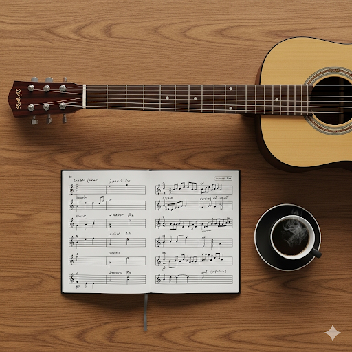

<section class="hero-section">
    
    <h1>Guitar Lessons That Inspire</h1>
    
Unlock your musical potential with expert lessons for all ages and skill levels. Online & In-Person |
        Friendly | Professional

    <a href="mailto:coenwinchester.guitar@gmail.com?subject=Guitar%20Lesson%20Booking" class="btn-primary">Book a
        Lesson</a>
    <!-- 
Call/Text: <a href="tel:0411111222">0411 111 222</a>
 -->
</section>

<section class="welcome-section">
    <h2>Welcome to my website!</h2>
    

        

            
I'm Coen Winchester, a passionate guitar teacher based in Springfield. Whether you're a complete
                beginner
                or an advanced player, I offer lessons designed to help you reach your musical goals. Join me for a
                fun,
                supportive, and inspiring learning experience!

            
 Lorem ipsum dolor sit amet, consectetur adipiscing elit. Duis sit amet lacinia lacus, eget aliquet
                ipsum. Nam quis quam eget risus vestibulum facilisis. Quisque bibendum faucibus nunc, vel laoreet
                nunc
                volutpat eu. Sed quis massa vitae ante tristique sagittis. Quisque tellus enim, vehicula a neque
                venenatis, pulvinar pulvinar magna. Aliquam interdum bibendum mollis. Suspendisse egestas rhoncus
                ultricies. Nullam egestas odio mauris, sit amet dapibus lectus ultrices et. Aliquam malesuada
                pellentesque libero eget mattis. Morbi egestas faucibus urna, at consequat risus.

        

        

            <h3>Latest Articles</h3>
            <ul>
            
                <li>
                    <a href="{{ post.url | relative_url }}">
                        
                            
                        
                        {{ post.title }}
                    </a>
                </li>
            
            </ul>
        

        <!--  -->
    

</section>

<section id="pricing" class="features">
    

        <h3>Private Lessons</h3>
        
One-on-one 60-minute sessions tailored to your goals.  <strong>$55 per lesson</strong>

    

    

        <h3>Online Lessons</h3>
        
Learn from anywhere via Zoom or Skype.  <strong>$45 per lesson</strong>

    

    

        <h3>Group Lessons</h3>
        
Up to 4 students per group.  <strong>$25 per person / hour</strong>

    

    

        <h3>Guitar Setup & Advice</h3>
        
Help with buying, setting up, and maintaining your instrument.

    

</section>

<section id="videos">
    

        

            
            

        

        

            
            

        

        

            
            

        

        

            
            

        

    

    

        

            <button class="close-btn" aria-label="Close">&times;</button>
            <iframe src="" frameborder="0" allowfullscreen></iframe>
        

    

    
</section>

<section id="faq">
    <h2>Frequently Asked Questions</h2>
    

        

            
What ages do you teach?

            
I teach students of all ages, from children to adults.

        

        

            
Do I need my own guitar?

            
It's best to have your own guitar, but I can provide advice on purchasing or renting one.

        

        

            
Can I do lessons online?

            
Yes! Online lessons are available via Zoom or Skype.

        

        

            
What styles do you teach?

            
I teach a range of styles including rock, pop, blues, jazz, and classical.

        

        

            
How do I book a lesson?

            
Just email me or call/text the number above to arrange your first lesson.

        

    

</section>